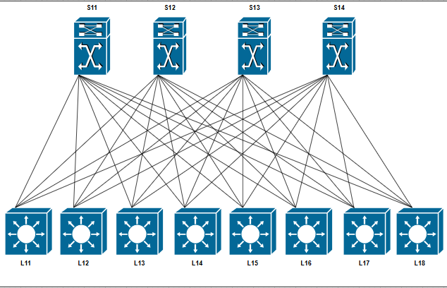
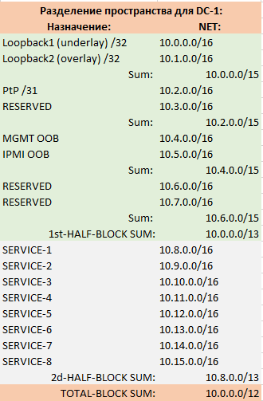
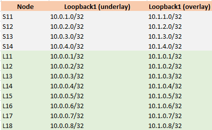
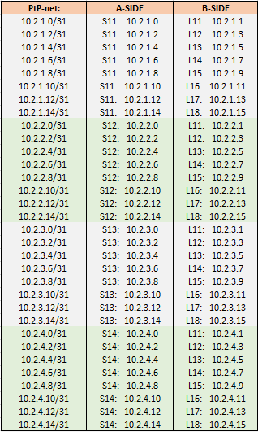

## Распределение адресного пространства(IPv4):

### Пример:  разбитие на 32 блока /13

Общая формула: 10.Dn.Sn.X/mask 

Dn=8(n-1)+K, 
где n=номер блока (DataCenter) c 1 по 32; k=порядок сетей при разбивке с 0 по 7

| Назначение:              | NET:           |LOGIC:   |
| ------------------------ | -------------- |---------|
| Loopback1 (underlay) /32 | 10.`0`.0.0/16  | `Dn=8(1-1)+0=0` |
| Loopback2 (overlay) /32  |	10.`1`.0.0/16 | `Dn=8(1-1)+1=1` |
| Sum: 	| 10.0.0.0/15      |

| Назначение:              | NET:           |LOGIC:   |
| ------------------------ | -------------- |---------|
| PtP /31	                 | 10.`2`.0.0/16  | `Dn=8(1-1)+2=2` |
| RESERVED                 |	10.`3`.0.0/16 | `Dn=8(1-1)+3=3` |
| Sum: 	                   | 10.2.0.0/15    |

начало: 

тест1: 

тест2: 

тест3:  

