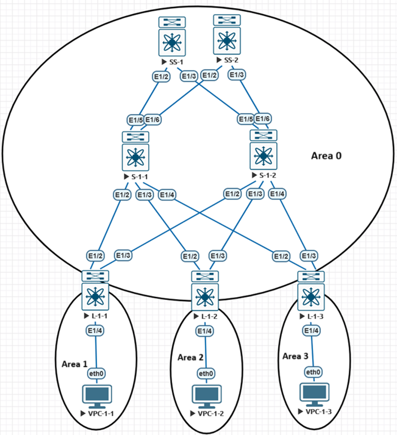
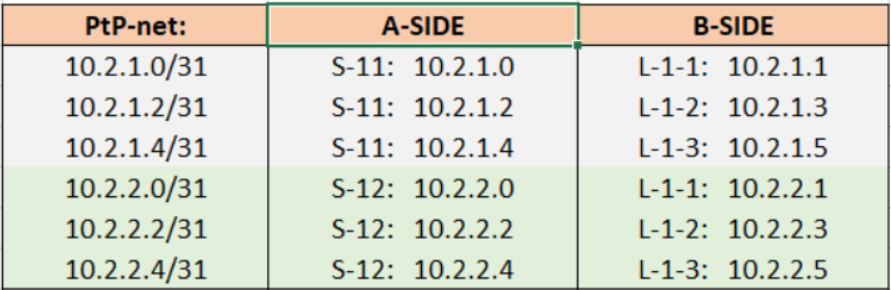

## Настройка OSPF в сети CLOS

### Общая схема взаимодействия свичей сети CLOS (leaf,spine,super-spine) 

### Используемое адресное пространство для Loopback интерфейсов

### Используемое адресное пространство для Interlinks

