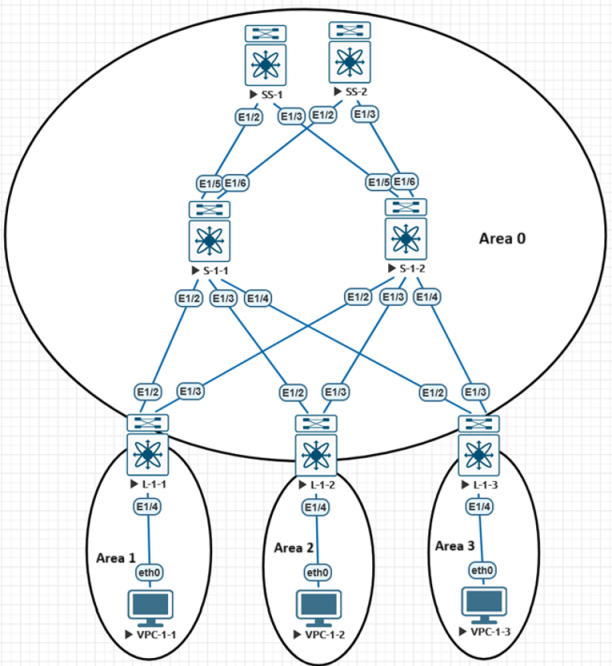
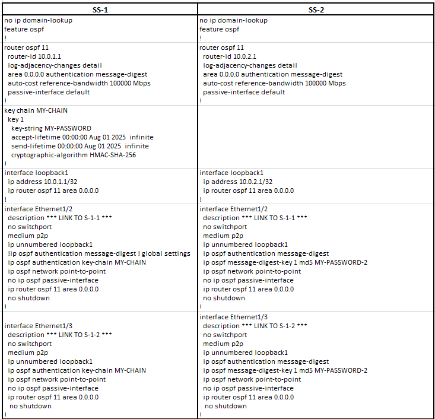
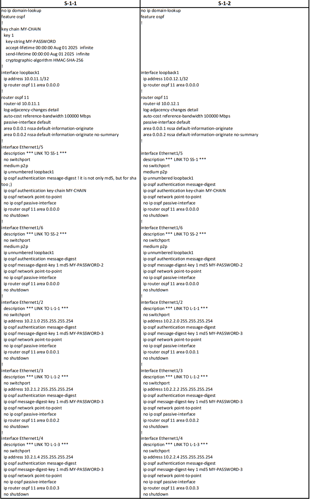
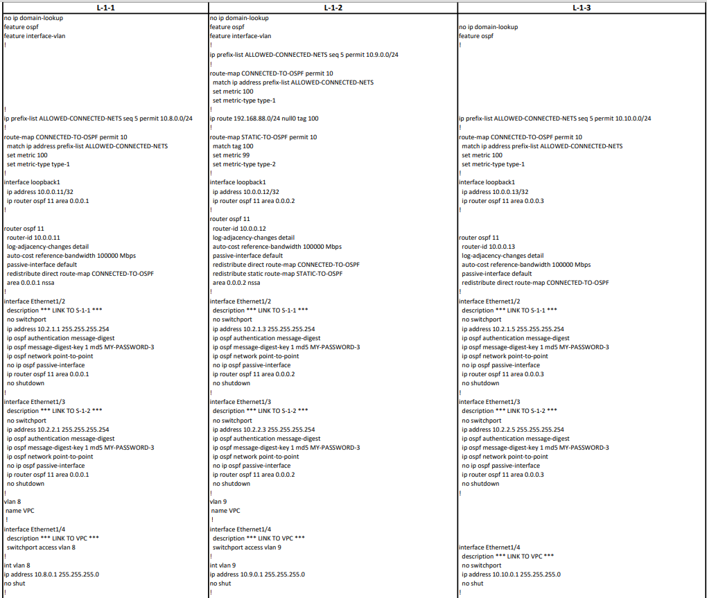

## Настройка OSPF в сети CLOS

### Общая схема взаимодействия свичей сети CLOS (leaf,spine,super-spine) 

### Используемое адресное пространство для Loopback интерфейсов, интерлинков

### Используемое адресное пространство для сервисных сетей (на примере VPC)

## Описание:
На каждом роутере изменил reference-bandwidth на 100Gb/s и authentication (MD5/SHA-256).

SS-1 и SS-2 - Backbone Routers.  Через эти роутеры будем стыковать POD1 с другим датацентром POD2.

S-1-1, S-1-2 - ABR Routers, осуществляют взаимодействие Backbone Area и NSSA, Totally NSSA, Standard Area.
 Разбитие на множество зон сделано для проработки практических навыков. 
 

Тип сети на всех линках изменен на PtP (исключение LSA2). Для PtP линков между SS-1 & S-1-1/S-1-2 и SS-2 & S-1-1/S-1-2 используется unnumbred конфигурация.

Для PtP линков между S-1-1 & L-1-1/L-1-2/L-1-3 и S-1-2 & L-1-1/L-1-2/L-1-3 используется конфигурация сетей /31.

L-1-1/L-1-2/L-1-3 являются ASBR, так как выполняют редистрибьюцию. По этой же причине нельзя использовать Stub Area/Totally Stub Area для них.

Зона типа: NSSA(+ def.route) находится на S-1-1/S-1-2 и L-1-1.  Использовал redistribution connected с помощью route-map.

Зона типа: Totally NSSA (+ def.route) находится на S-1-1/S-1-2 и L-1-2. Отработал исключение LSA3.  Использовал redistribution connected & static с помощью route-map.

Зона типа: Standard Area находится на S-1-1/S-1-2 и L-1-3.  Использовал redistribution connected с помощью route-map.

## Дополнительно:
[Проверка доступности узлов](https://github.com/dknet77/VxLAN/blob/main/LABS/1-2/OUTPUT/IP-CONNECTIVITY.txt)

[Вывод команд: show ip route & sh ip ospf neighbor/database/interface](https://github.com/dknet77/VxLAN/tree/main/LABS/1-2/OUTPUT)

Настройки для каждого роутера приведены здесь: [CONFIGS](https://github.com/dknet77/VxLAN/tree/main/LABS/1-2/CONFIGS)

Отработал сценарий вывода трафика с роутера, для последующих работ: [MAINTENANCE](https://github.com/dknet77/VxLAN/blob/main/LABS/1-2/APPENDIX/MAINTENANCE.txt)

На практике необходимо использование [BFD & MicroBFD](https://github.com/dknet77/VxLAN/blob/main/LABS/1-2/APPENDIX/BFD.txt)
