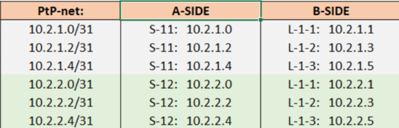

## Настройка OSPF в сети CLOS

### Общая схема взаимодействия свичей сети CLOS (leaf,spine,super-spine) 

### Используемое адресное пространство для Loopback интерфейсов, интерлинков

### Используемое адресное пространство для сервисных сетей (на примере VPC)

## Общие настройки OSPF , независимо от роли маршрутизатора и его AS:

## Настройки OSPF для Super Spine (Backbone routers):

## Настройки OSPF для SP-1-1, S-1-2, S-1-3 (ABR routers):

## Настройки OSPF для L-1-1(Stub Area), L-1-2(Totaly Stub Area), L-1-3(Totaly NSSA)
