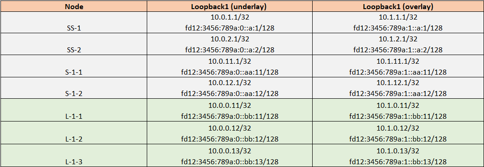
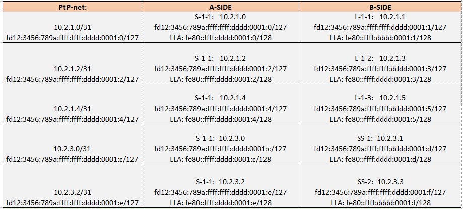
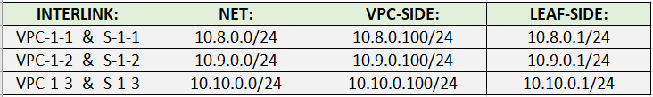
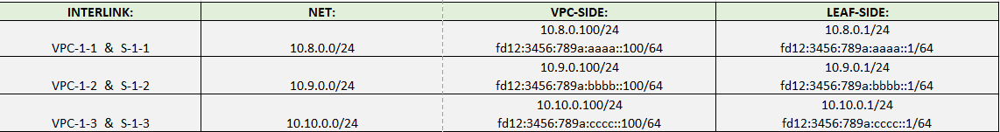
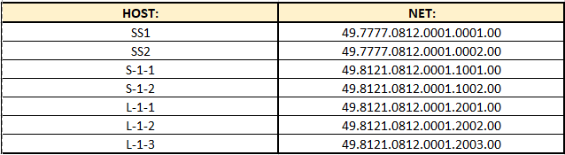

## Настройка IS-IS в сети CLOS

### Общая схема взаимодействия свичей сети CLOS (leaf,spine,super-spine) 

### Используемое адресное пространство для Loopback интерфейсов, интерлинков

### Используемое адресное пространство для сервисных сетей (на примере VPC)

### IPV6 part
`fc00::/7` — Unique Local Addresses (ULA) — Локальные адреса

Пример: fd12:3456:789a::1/64 (где 12:3456:789a — ваш случайный Global ID).

`prefix+L-bit(8bits):global-id(40bits):subnet-id(16bits)::interface id(64bits)`

Префикс (7 бит): Всегда 1111110 в двоичном виде, что в шестнадцатеричном представляет собой fc или fd.

Бит (L): Определяет, является ли адрес локально назначенным.

    L = 1: Адрес локально назначен. Это и есть тот самый fd00::/8, который мы используем. 
	Это означает, что Global ID был сгенерирован случайным образом.
    
    L = 0: Зарезервировано для будущего использования (fc00::/8). 
	В будущем, возможно, появится центральный орган, который будет выдавать эти префиксы. Сейчас не используется.
	
Global ID (40 бит): Случайно сгенерированный идентификатор, который должен обеспечивать уникальность вашего префикса.

Subnet ID (16 бит): Идентификатор подсети внутри вашей сети. Вы можете использовать его для сегментации сети (например, 0001 для отдела бухгалтерии, 0002 для отдела IT и т.д.). 
                    Это дает вам 65536 возможных подсетей (/64) в рамках одного префикса.
                    
Interface ID (64 бит): Идентификатор интерфейса (хоста), обычно derived из MAC-адреса (EUI-64) или генерируемый случайным образом для конфиденциальности.

#### Возьмем блок: fd12:3456:789a::/48 и поделим на основые задачи:

fd12:3456:789a:000::/64 - loopbacks underlay

fd12:3456:789a:001::/64 - loopbacks overlay

fd12:3456:789a:aaaa::/64 - Service-1

fd12:3456:789a:bbbb::/64 - Service-2

fd12:3456:789a:cccc::/64 - Service-3

fd12:3456:789a:ffff::/64 - PtPs

LLA: fe80::ffff:dddd:0001:0/128

## IS-IS   NET (Network Entity Title)

  `AFI.AREA-ID.SYS-ID.SEL`

AFI=49 (like RFC1918)

SEL=00 

Area ID=0001 or 7777/4951/8121

SYS-ID - можно исползовать разные подходы.

#### Например можно создать SYS-ID на основе loopback роутера. Тогда при анализе можно будет понять какой роутер создал PDU.

`Если loopback=10.130.5.8, то для начала запишем в таком виде: 010.130.005.008`

`Затем уберем точки: 010130005008 и разделим на 3 октета: 0101.3000.5008`

#### Или можно создать SYS-ID вкладывая осмысленные значения. 

`AAAA.BBBB.CCCC, гда АААA=город (например: 0001/0002/0003)`

`где BBBB=Дата Центр (например: 0001/0002/0003 - M9/SELECTEL/LINX)`

`где СССС=END-POINT (например: 0001/1001/2003 - 0 - SuperSpine, 1 - Spine, 2 - Leaf)`

#### В этой лабе используем такие значения:

## Описание:

SS1, SS2 - Super Spine с отдельной AS7777 и это роутеры только Level-2.

#### Конфигурация Super-Spine роутеров (SS-1, SS-2):

    interface EthernetX/Y
		description *** LINK TO S-1-2 ***
		no switchport
		medium p2p
		ip address 10.2.3.2/31
		ipv6 address fd12:3456:789a:ffff:ffff:dddd:1:e/127
		ipv6 link-local fe80::ffff:dddd:1:e
		isis network point-to-point
		isis circuit-type level-2
		isis authentication-type md5
		isis authentication key-chain MY-CHAIN
		ip router isis UNDERLAY
		ipv6 router isis UNDERLAY
		no isis passive-interface level-2
		no shutdown

    router isis UNDERLAY
		net 49.7777.0812.0001.0001.00
		is-type level-2
		reference-bandwidth 100 Gbps
		address-family ipv4 unicast
		router-id 10.0.1.1
		address-family ipv6 unicast
		passive-interface default level-1-2
		
	interface loopback1
		ip address 10.0.1.1/32
		ipv6 address fd12:3456:789a::a:1/128
		ip router isis UNDERLAY
		ipv6 router isis UNDERLAY
		no isis passive-interface level-2
		
Loopback1(IPv4, IPv6) не будет известен на роутерах L-1-1, L-1-2, L-1-3 (only Level-1) и сети Level-1 не известны роутерам SS-1, SS-2 (only Level-2).

Такой дизайн протокола, своего рода изоляция.  При необходимости это можно исправить (путем distribution/redistribution).

ABR (S-1-1, S-1-2) являются роутерами Level-1/Level-2.  

ABR (Spine) роутеры и Leaf роутеры находятся в отдельной AS-NUM: 8121 

ABR-routers генерирут ATT-bit и стимулируют L-1-1, L-1-2, L-1-3 создать 0.0.0.0/0 с next-hop (ABR-router).

В результате L2 локальные префиксы ABR будут доступны c L1-only роутеров.

#### Конфиг на Spine (ABR) выглядит так:

	interface EthernetX/Y
		description *** LINK TO L-1-1 ***
		no switchport
		ip address 10.2.1.0/31
		ipv6 address fd12:3456:789a:ffff:ffff:dddd:1:0/127
		ipv6 link-local fe80::ffff:dddd:1:0
		isis network point-to-point
		isis circuit-type level-1
		isis authentication-type md5
		isis authentication key-chain MY-CHAIN
		ip router isis UNDERLAY
		ipv6 router isis UNDERLAY
		no isis passive-interface level-1
		no shutdown 

	interface EthernetA/B
		description *** LINK TO SS-1 ***
		no switchport
		medium p2p
		ip address 10.2.3.1/31
		ipv6 address fd12:3456:789a:ffff:ffff:dddd:1:d/127
		ipv6 link-local fe80::ffff:dddd:1:d
		isis network point-to-point
		isis circuit-type level-2
		isis authentication-type md5
		isis authentication key-chain MY-CHAIN
		ip router isis UNDERLAY
		ipv6 router isis UNDERLAY
		no isis passive-interface level-2
		no shutdown
		
	interface loopback1
		ip address 10.0.11.1/32
		ipv6 address fd12:3456:789a::aa:11/128
		ip router isis UNDERLAY
		ipv6 router isis UNDERLAY
		no isis passive-interface level-1-2
		
	router isis UNDERLAY
		net 49.8121.0812.0001.1001.00
		reference-bandwidth 100 Gbps
		address-family ipv4 unicast
		router-id 10.0.11.1
		address-family ipv6 unicast
		passive-interface default level-1-2
		
#### На LEAF роутерах (L1-only) конфиг выглядит так:

	ipv6 prefix-list ISIS-CONNECTED-IPV6 seq 10 permit
	ip prefix-list ISIS-CONNECTED seq 10 permit 10.8.0.0/24 

	route-map ISIS-CONNECTED permit 10
		match ip address prefix-list ISIS-CONNECTED 

	route-map ISIS-CONNECTED-IPV6 permit 10
		match ipv6 address prefix-list ISIS-CONNECTED-IPV6
		
	interface EthernetX/Y
		description *** LINK TO S-1-1 ***
		no switchport
		ip address 10.2.1.1/31
		ipv6 address fd12:3456:789a:ffff:ffff:dddd:1:1/127
		ipv6 link-local fe80::ffff:dddd:1:1
		isis network point-to-point
		isis circuit-type level-1
		isis authentication-type md5
		isis authentication key-chain MY-CHAIN
		ip router isis UNDERLAY
		ipv6 router isis UNDERLAY
		no isis passive-interface level-1
		no shutdown
		
	interface loopback1
		ip address 10.0.0.11/32
		ipv6 address fd12:3456:789a::bb:11/128
		ip router isis UNDERLAY
		ipv6 router isis UNDERLAY
		
	router isis UNDERLAY
		net 49.8121.0812.0001.2001.00
		reference-bandwidth 100 Gbps
			address-family ipv4 unicast
				redistribute direct route-map ISIS-CONNECTED
				router-id 10.0.0.11
			address-family ipv6 unicast
				redistribute direct route-map ISIS-CONNECTED-IPV6
		passive-interface default level-1-2

Важная для понимания информация: [ATT-BIT and OL-BIT](https://github.com/dknet77/VxLAN/tree/main/LABS/1-3/APPENDIX/ATT_OL-bit.txt)

## Дополнительно:
[Проверка доступности узлов](https://github.com/dknet77/VxLAN/blob/main/LABS/1-3/OUTPUT/IP-CONNECTIVITY.txt)

[Вывод show-команд](https://github.com/dknet77/VxLAN/tree/main/LABS/1-3/OUTPUT)

Настройки для каждого роутера приведены здесь: [CONFIGS](https://github.com/dknet77/VxLAN/tree/main/LABS/1-3/CONFIGS)

На практике необходимо использование [BFD](https://github.com/dknet77/VxLAN/tree/main/LABS/1-3/APPENDIX/IS-IS_BFD.txt)
