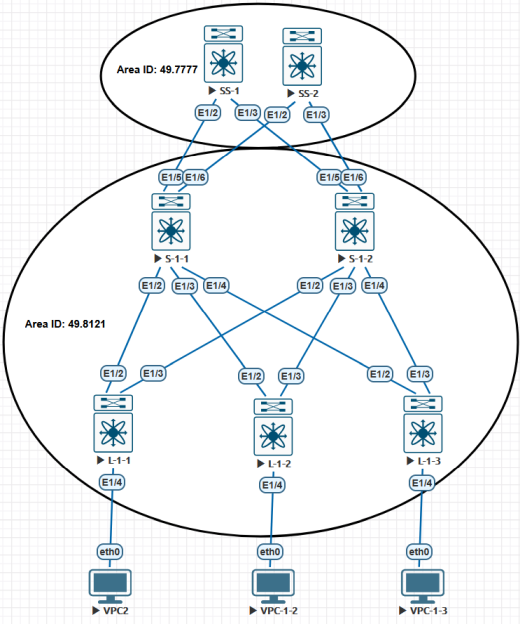
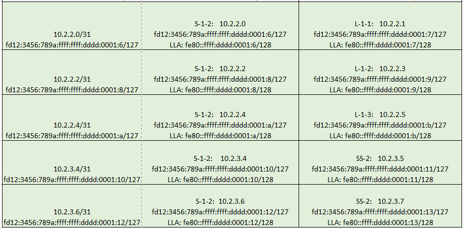

## Настройка IS-IS в сети CLOS

### Общая схема взаимодействия свичей сети CLOS (leaf,spine,super-spine) 

### Используемое адресное пространство для Loopback интерфейсов, интерлинков

### Используемое адресное пространство для сервисных сетей (на примере VPC)

### IPV6 part
`fc00::/7` — Unique Local Addresses (ULA) — Локальные адреса

Пример: fd12:3456:789a::1/64 (где 12:3456:789a — ваш случайный Global ID).

`prefix+L-bit(8bits):global-id(40bits):subnet-id(16bits)::interface id(64bits)`

Префикс (7 бит): Всегда 1111110 в двоичном виде, что в шестнадцатеричном представляет собой fc или fd.

Бит (L): Определяет, является ли адрес локально назначенным.

    L = 1: Адрес локально назначен. Это и есть тот самый fd00::/8, который мы используем. 
	Это означает, что Global ID был сгенерирован случайным образом.
    
    L = 0: Зарезервировано для будущего использования (fc00::/8). 
	В будущем, возможно, появится центральный орган, который будет выдавать эти префиксы. Сейчас не используется.
	
Global ID (40 бит): Случайно сгенерированный идентификатор, который должен обеспечивать уникальность вашего префикса.

Subnet ID (16 бит): Идентификатор подсети внутри вашей сети. Вы можете использовать его для сегментации сети (например, 0001 для отдела бухгалтерии, 0002 для отдела IT и т.д.). 
                    Это дает вам 65536 возможных подсетей (/64) в рамках одного префикса.
                    
Interface ID (64 бит): Идентификатор интерфейса (хоста), обычно derived из MAC-адреса (EUI-64) или генерируемый случайным образом для конфиденциальности.

#### Возьмем блок: fd12:3456:789a::/48 и поделим на основые задачи:

fd12:3456:789a:000::/64 - loopbacks underlay

fd12:3456:789a:001::/64 - loopbacks overlay

fd12:3456:789a:aaaa::/64 - Service-1

fd12:3456:789a:bbbb::/64 - Service-2

fd12:3456:789a:cccc::/64 - Service-3

fd12:3456:789a:ffff::/64 - PtPs

LLA: fe80::ffff:dddd:0001:0/128

## NET (Network Entity Title)

  `AFI.AREA-ID.SYS-ID.SEL`

AFI=49 (like RFC1918)

SEL=00 

Area ID=0001 or 7777/4951/8121

SYS-ID - можно исползовать разные подходы.

#### Например можно создать SYS-ID на основе loopback роутера. Тогда при анализе можно будет понять какой роутер создал PDU.

`Если loopback=10.130.5.8, то для начала запишем в таком виде: 010.130.005.008`

`Затем уберем точки: 010130005008 и разделим на 3 октета: 0101.3000.5008`

## Описание:

На каждом роутере изменил reference-bandwidth на 100Gb/s и authentication (MD5/SHA-256).

SS-1 и SS-2 - Backbone Routers.  Через эти роутеры будем стыковать POD1 с другим датацентром POD2.

S-1-1, S-1-2 - ABR Routers, осуществляют взаимодействие Backbone Area и NSSA, Totally NSSA, Standard Area.
 Разбитие на множество зон сделано для проработки практических навыков. 
 

Тип сети на всех линках изменен на PtP (исключение LSA2). Для PtP линков между SS-1 & S-1-1/S-1-2 и SS-2 & S-1-1/S-1-2 используется unnumbred конфигурация.

Для PtP линков между S-1-1 & L-1-1/L-1-2/L-1-3 и S-1-2 & L-1-1/L-1-2/L-1-3 используется конфигурация сетей /31.

L-1-1/L-1-2/L-1-3 являются ASBR, так как выполняют редистрибьюцию. По этой же причине нельзя использовать Stub Area/Totally Stub Area для них.

Зона типа: NSSA(+ def.route) находится на S-1-1/S-1-2 и L-1-1.  Использовал redistribution connected с помощью route-map.

Зона типа: Totally NSSA (+ def.route) находится на S-1-1/S-1-2 и L-1-2. Отработал исключение LSA3.  Использовал redistribution connected & static с помощью route-map.

Зона типа: Standard Area находится на S-1-1/S-1-2 и L-1-3.  Использовал redistribution connected с помощью route-map.

## Дополнительно:
[Проверка доступности узлов](https://github.com/dknet77/VxLAN/blob/main/LABS/1-3/OUTPUT/IP-CONNECTIVITY.txt)

[Вывод команд: SHOW ](https://github.com/dknet77/VxLAN/tree/main/LABS/1-3/OUTPUT)

Настройки для каждого роутера приведены здесь: [CONFIGS](https://github.com/dknet77/VxLAN/tree/main/LABS/1-3/CONFIGS)

Важная для понимания информация: [ATT-BIT and OL-BIT](https://github.com/dknet77/VxLAN/tree/main/LABS/1-3/APPENDIX/ATT_OL-bit.txt)

На практике необходимо использование [BFD](https://github.com/dknet77/VxLAN/tree/main/LABS/1-3/APPENDIX/IS-IS_BFD.txt)
