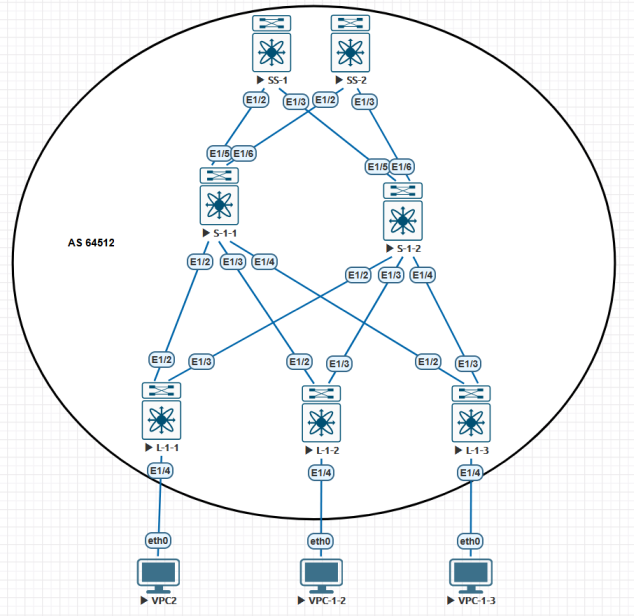

## Общая схема (iBGP) underlay

#### %%%%%%%%%%%%%%%%%%%%%%%%% LEAF (L-1-1) %%%%%%%%%%%%%%%%%%%%%%%%%%%%%
 
  	ip prefix-list CONNECTED seq 10 permit 10.8.0.0/24
 	 ip prefix-list CONNECTED seq 20 permit 10.0.0.11/32
  	ip prefix-list CONNECTED seq 30 permit 10.2.1.1/31
 	 ip prefix-list CONNECTED seq 40 permit 10.2.2.1/31

 	 route-map CONNECTED permit 10
   		 match ip address prefix-list CONNECTED
   		 set origin igp

 	 ip as-path access-list OWN-AS seq 10 permit "^$"
	
	  route-map SPINE-IPV4-IN permit 10
  		  match as-path OWN-AS
   		 set local-preference 150

 	 route-map SPINE-IPV4-OUT permit 10

	  route-map SPINE-IPV6-IN permit 10
  		  match as-path OWN-AS
  		  set local-preference 150

  	route-map SPINE-IPV6-OUT permit 10

	router bgp 64512
	  router-id 10.0.0.11
 	 timers bgp 3 9
 	 reconnect-interval 12
 	 address-family ipv4 unicast
	  	  redistribute direct route-map CONNECTED
   		 maximum-paths ibgp 2
 	 address-family ipv6 unicast
	    network fd12:3456:789a::bb:11/128
  	    maximum-paths ibgp 2

	template peer-session SPINE-SESSION
  	    bfd
    	remote-as 64512
   		 password cisco

	template peer-policy SPINE-IPV4-POLICY
 	   send-community extended
   	   route-map SPINE-IPV4-IN in
	   route-map SPINE-IPV4-OUT out
  	   maximum-prefix 30000
       soft-reconfiguration inbound always

	template peer-policy SPINE-IPV6-POLICY
	    send-community extended
	    route-map SPINE-IPV6-IN in
	    route-map SPINE-IPV6-OUT out
 	   maximum-prefix 30000
  	  soft-reconfiguration inbound always
	
	template peer SPINE-IPV4
 	   inherit peer-session SPINE-SESSION
   		 address-family ipv4 unicast
    	nherit peer-policy SPINE-IPV4-POLICY 10 ! the preference value for this peer policy

	template peer SPINE-IPV6
  	  inherit peer-session SPINE-SESSION
  	  address-family ipv6 unicast
      inherit peer-policy SPINE-IPV6-POLICY 10

	neighbor 10.2.1.0
	    inherit peer SPINE-IPV4
 	   description *** SPINE-1-1 ***
	
	neighbor fd12:3456:789a:ffff:ffff:dddd:1:0
	    inherit peer SPINE-IPV6
		description *** SPINE-1-1 ***

 желтое выделение 
`==текст==`   ==текст==

  

[Адресное пространство IPv4 и IPv6](https://github.com/dknet77/VxLAN/tree/main/LABS/1-4/ip-plan.md)

[Remarks](https://github.com/dknet77/VxLAN/tree/main/LABS/1-4/BN.md)

[iBGP: IP-CONNECTIVITY](https://github.com/dknet77/VxLAN/tree/main/LABS/1-4/iBGP-CHECK.txt)
