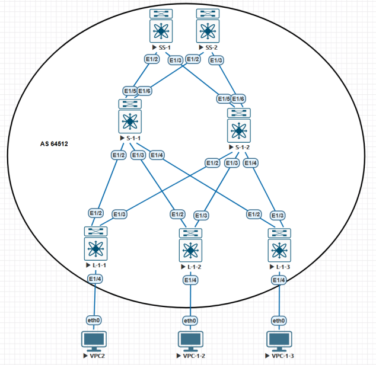
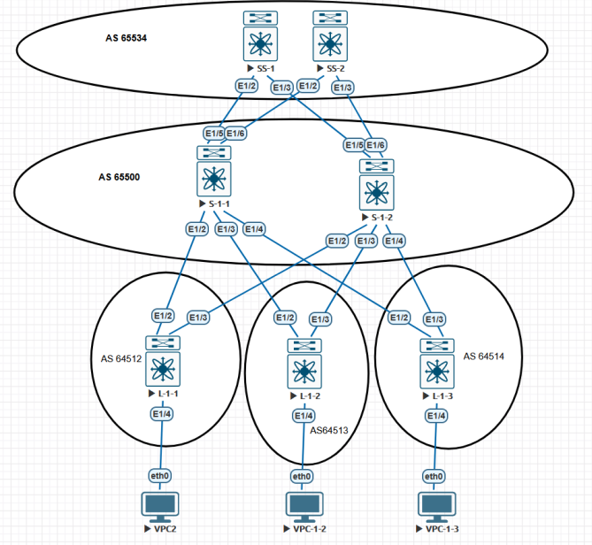

## VxLAN
Leaf1 и Leaf2 имеют подключение серверов в одном влане, но нет транков между ними.

Тем не менее серверам требуется L2 подключение и такая задача решается с помощью VxLAN.

Underlay сеть нужна только для доступности ip интерфейсов (loopbacks, ptp).

Overlay передает необходимые данные об удаленном L2 сегменте поверх L3 сети.

Два роутера могут связать один влан через L3 cеть без настроек EVPN.

	feature vn-segment-vlan-based
	feature nv overlay
 
 	vlan 8
  		name SERVER-VLAN
  		vn-segment 10008
	
	interface Ethernet1/4
  		description *** LINK TO SERVER ***
  		switchport access vlan 8

	interface nve1 
 		 no shutdown
 		 source-interface loopback2
 		 member vni 10008
		ingress-replication protocol static
  			peer 10.1.0.12
	 		
 Интерфейс nve по сути похож на туннельный интерфейс GRE.
 
 <mark style="background-color: #FFFF00"> ingress-replication </mark> указывает каким способом будет расспостраняться BUM трафик. 
 
 В этом случае статически прописан второй роутер, у которого есть подключение в том же влане.
 
 При увеличении кол-ва Leaf-коммутаторов и вланов которые необходимо растянуть по всей сети, такой подход не маштабируем.
 
 EVPN решает эти задачи в топологии Spine&Leaf.
 
 Cущестуют важные нюансы конфигурации в зависимости от того какой протокол (iBGP or eBGP) исользует EVPN. 

## VxLAN + EVPN при iBGP (Overlay)

#### %%%%%%%%%%%%%%%%%%%%%%%%% LEAF (L-1-1) %%%%%%%%%%%%%%%%%%%%%%%%%%%%%
 
    feature vn-segment-vlan-based ! Service Model: VlanBased - У каждого VLAN свой MAC-VRF (свои RD/RT) (N:N)
    feature nv overlay ! дла работы VxLAN
    nv overlay evpn ! в качестве overlay будет evpn

    interface loopback2
     ip address 10.1.0.11/32 ! надо сделать доступным через underlay
    
    interface Ethernet1/4
     description *** LINK TO VPC1 ***
     switchport access vlan 8

    vlan 8
     name VPC8
     vn-segment 10008 ! Ассоциируем VLAN с номер VNI 
    
    interface nve1 
     no shutdown
     host-reachability protocol bgp
     source-interface loopback2
     member vni 10008 ! Добавляем VNI 10000 для работы через интерфейс NVE. для инкапсуляции в VxLAN
        ingress-replication protocol bgp ! указываем, что для распространения BUM трафика используем BGP

    evpn
     vni 10008 l2
          rd auto    
		  ! auto-derived Route Distinguisher (RD): MAC-VRF with BGP Router ID 10.0.0.11 and VLAN 8 (32767+8) - RD 10.0.0.11:32775
          route-target import auto 
		  !  auto derived Route-Target (RT): MAC-VRF within ASN 64512 and L2VNI 10008 - Route-Target 64512:10008
          route-target export auto

    router bgp 64512
     router-id 10.0.0.11
     timers bgp 3 9
     bestpath as-path multipath-relax
     reconnect-interval 12

     address-family l2vpn evpn
          maximum-paths 10

     template peer SPINE-IPV4-OVERLAY
          remote-as 64512
          update-source loopback2
          address-family l2vpn evpn
               send-community
               send-community extended

     neighbor 10.1.11.1
          inherit peer SPINE-IPV4-OVERLAY
#### %%%%%%%%%%%%%%%%%%%%%%%%% LEAF (L-1-2) %%%%%%%%%%%%%%%%%%%%%%%%%%%%%

    feature vn-segment-vlan-based 
    feature nv overlay 
    nv overlay evpn 

	interface loopback2
		ip address 10.1.0.12/32  
		
	interface Ethernet1/4
		description *** LINK TO VPC2 ***
		switchport access vlan 8

	vlan 8
	name VPC8
	vn-segment 10008

	interface nve1
		no shutdown
		host-reachability protocol bgp
		source-interface loopback2
		member vni 10008
		ingress-replication protocol bgp 

	evpn
		vni 10008 l2
		rd auto
		route-target import auto
		route-target export auto

	router bgp 64512
		router-id 10.0.0.12
		timers bgp 3 9
		bestpath as-path multipath-relax
		reconnect-interval 12

			address-family l2vpn evpn
				maximum-paths 10

		template peer SPINE-IPV4-OVERLAY
			remote-as 64512
			update-source loopback2
				address-family l2vpn evpn
					send-community
					send-community extended

		neighbor 10.1.11.1
			inherit peer SPINE-IPV4-OVERLAY

#### %%%%%%%%%%%%%%%%%%%%%%%%% SPINE (S-1-1) %%%%%%%%%%%%%%%%%%%%%%%%%%%%%

	    nv overlay evpn

	interface loopback2
		ip address 10.1.11.1/32
 
	router bgp 64512
		router-id 10.0.11.1
		timers bgp 3 9
		reconnect-interval 12
		log-neighbor-changes

			address-family l2vpn evpn
			maximum-paths 10

		template peer LEAF-IPV4-OVERLAY
			remote-as 64512
			update-source loopback2
				address-family l2vpn evpn
					route-reflector-client
					send-community
					send-community extended

		neighbor 10.1.0.11
			inherit peer LEAF-IPV4-OVERLAY

		neighbor 10.1.0.12
			inherit peer LEAF-IPV4-OVERLAY

#### %%%%%%%%%%%%%%%% решение по ситуации с BUM-трафиком: Suppress-ARP %%%%%%%%%%%%%%%%%%
При увеличении кол-ва хостов возникает проблема BUM. Основной генератор Broadcast в Ethernet сетях сами хосты через протокол ARP.

На nexus реализован следующий механизм для борьбы с ARP запросами — suppress-arp.

Работа данной фичи выглядит следующим образом:

    1) Host-1 отправляет APR запрос на Broadcast адрес своей сети.
	
    2) Запрос доходит до Leaf коммутатора и вместо того чтобы передать этот запрос дальше в фабрику
	в сторону Host-2 — Leaf отвечает сам и указывает нужный IP и MAC.
	
Чтобы Leaf знал ip надо чтобы он получал и отправлял EVPN route-type 2 (mac&ip).

Для этого мы на каждом Leaf создадим SVI c одинаковым IP и одним virtual MAC.

    nv overlay evpn

	feature interface-vlan

	fabric forwarding anycast-gateway-mac 0001.0001.0001
    ! задаем virtual mac для создания распределенного шлюза между всеми коммутаторами

	interface Vlan8
		no shutdown
		ip address 10.8.0.1/24          ! на всех Leaf задаем одинаковый IP
		fabric forwarding mode anycast-gateway    ! говорим использовать Virtual mac

	interface nve1
		member vni 10008   
		suppress-arp ! включаем для каждого VNI отдельно

Дальше возникает некоторая сложность:

Для работы данной фичи необходимо место в TCAM памяти. Приведу пример настройки для suppress-arp:

#### hardware access-list tcam region arp-ether 256

Для данной настройки потребуется double-wide. То есть если задаете 256, то в TCAM необходимо освободить 512.

Настройка TCAM выходит за пределы данной статьи, так как настройка TCAM зависит только от задачи поставленной перед Вами и может отличаться от одной сети к другой.

Внедрение suppress-arp необходимо сделать на всех Leaf коммутаторах. Однако сложность может возникнуть при настройке на парах Leaf, находящихся в домене VPC.

При изменении TCAM, консистенция между парами будет нарушена и одна нода может быть выведена из работы.

Дополнительно для применения настройки изменении TCAM может потребоваться перезагрузка устройства.

-------------------------------------------------------------------------------------------------------------

[PRINTOUT](https://github.com/dknet77/VxLAN/tree/main/LABS/2-1/OUPUT/VxLAN_iBGP.txt)

[REMARKS](https://github.com/dknet77/VxLAN/tree/main/LABS/2-1/APPENDIX/NB.txt)

-------------------------------------------------------------------------------------------------------------

 ## VxLAN + EVPN при eBGP (Overlay)

#### %%%%%%%%%%%%%%%%%%%%%%%%% LEAF (L-1-2) %%%%%%%%%%%%%%%%%%%%%%%%%%%%%
	feature vn-segment-vlan-based
	feature nv overlay
	feature bgp
	nv overlay evpn
	
	interface loopback2
		ip address 10.1.0.12/32  
		ip router ospf 11 area 0.0.0.2 ! надо сделать доступным через underlay

	interface Ethernet1/4
		description *** LINK TO VPC2 ***
		switchport access vlan 8
		no shut

	vlan 8
		name VPC8
		vn-segment 10008
	
	interface nve1
		no shutdown
		host-reachability protocol bgp
		source-interface loopback2
		member vni 10008
			ingress-replication protocol bgp 

		evpn
			vni 10008 l2
			rd auto
			route-target import auto
			route-target export auto

		router bgp 64513
			router-id 10.0.0.12
			timers bgp 3 9
			bestpath as-path multipath-relax
			reconnect-interval 12
		address-family l2vpn evpn
			maximum-paths 10
		template peer SPINE-IPV4-OVERLAY
			remote-as 65000
			update-source loopback2
			ebgp-multihop 2
			address-family l2vpn evpn
			send-community
			send-community extended
			rewrite-evpn-rt-asn
		neighbor 10.1.12.1
			inherit peer SPINE-IPV4-OVERLAY
			
#### %%%%%%%%%%%%%%%%%%%%%%%%% LEAF (L-1-3) %%%%%%%%%%%%%%%%%%%%%%%%%%%%%

[Адресное пространство IPv4 и IPv6](https://github.com/dknet77/VxLAN/tree/main/LABS/1-4/ip-plan.md)

[Remarks](https://github.com/dknet77/VxLAN/tree/main/LABS/1-4/BN.md)

