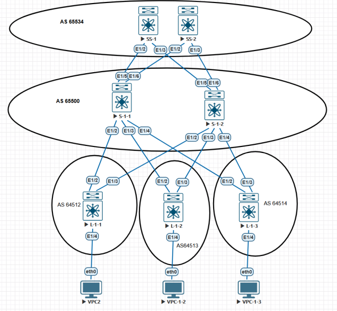
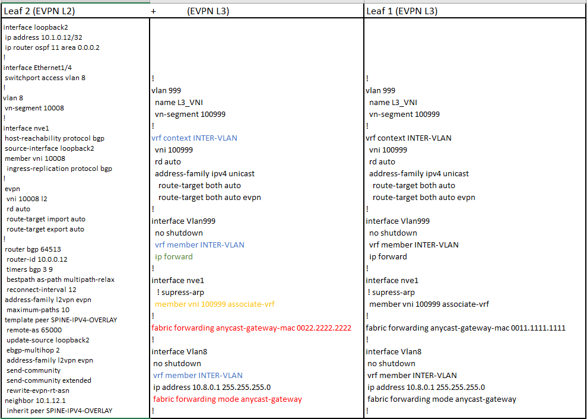

 ## VxLAN + EVPN при eBGP (Overlay) - роль Uderlay обеспечить ip-связанность

#### %%%%%%%%%%%%%%%%%%%%%%%% EVPN L3 %%%%%%%%%%%%%%%%%%%%%%%%%%%%%%%%%%%%%%%%%%%%

За Leaf1 и Leaf2 в влане 8 подключены два хоста (10.8.0.11 и 10.8.0.22).

У обоих указан маршут по умолчанию 10.8.0.1, но настройки AnyCast Gateway позволяют использовать один ip-адрес и разные MAC-адреса.

Пока в этой конфигурации только влан 8 и для Leaf1 и Leaf2 так и оставим, но мы планируем на Leaf 3 подключить хост в другом влане (влан 10).

На Leaf3 intervlan routing (между вланом 8 и 10) будет работать локально. Нам надо чтобы с Leaf1 и Leaf2 был доступен SVI vlan10 Leaf3, хотя vlan10 отсутствует на Leaf1&Leaf2.

Для этого на всех Leaf роутерах, надо создать влан 999 и VRF: INTER-VLAN. Затем надо L3 интерфейсы (SVI) включить в этот VRF.

#### %%%%%%%%%%%%%%%%%%%%%%%%% LEAF3 %%%%%%%%%%%%%%%%%%%%%%%%%%%%%
		nv overlay evpn
		feature ospf
		feature bgp
		feature interface-vlan
		feature vn-segment-vlan-based
		feature nv overlay
		!
		fabric forwarding anycast-gateway-mac 0033.3333.3333
		!
		vlan 8
			name VPC8
			vn-segment 10008
		vlan 10
			name VLAN10
			vn-segment 10010
		vlan 999
			name L3_VNI
			vn-segment 100999
		!
		vrf context INTER-VLAN
			vni 100999
			rd auto
			address-family ipv4 unicast
				route-target both auto
				route-target both auto evpn
		!
		interface Vlan8
			no shutdown
			vrf member INTER-VLAN
			ip address 10.8.0.1/24
			fabric forwarding mode anycast-gateway
		!
		interface Vlan10
			no shutdown
			vrf member INTER-VLAN
			ip address 10.10.0.1/24
			fabric forwarding mode anycast-gateway
		!
		interface Vlan999
			no shutdown
			vrf member INTER-VLAN
			ip forward
		!
		interface nve1
			no shutdown
			host-reachability protocol bgp
			source-interface loopback2
			member vni 10008
				ingress-replication protocol bgp
			member vni 10010
				ingress-replication protocol bgp
			member vni 100999 associate-vrf
		!
		interface Ethernet1/4
			switchport access vlan 8
		!	
		interface Ethernet1/5
			switchport access vlan 10
		!
		router bgp 64514
 		 router-id 10.0.0.13
  		timers bgp 3 9
  		bestpath as-path multipath-relax
  		reconnect-interval 12
  		address-family l2vpn evpn
    		maximum-paths 10
  		template peer SPINE-IPV4-OVERLAY
    		remote-as 65000
    		update-source loopback2
    		ebgp-multihop 2
    		address-family l2vpn evpn
      		send-community
      		send-community extended
      		rewrite-evpn-rt-asn
  		neighbor 10.1.12.1
    		inherit peer SPINE-IPV4-OVERLAY
		!	
		evpn
  		 vni 10008 l2
    		rd auto
    		route-target import auto
    		route-target export auto
  		 vni 10010 l2
    		rd auto
    		route-target import auto
    		route-target export auto

#### %%%%%%%%%%%%%%%% решение по ситуации с BUM-трафиком: Suppress-ARP %%%%%%%%%%%%%%%%%%
При увеличении кол-ва хостов возникает проблема BUM. Основной генератор Broadcast в Ethernet сетях сами хосты через протокол ARP.

На nexus реализован следующий механизм для борьбы с ARP запросами — suppress-arp.

Работа данной фичи выглядит следующим образом:

    1) Host-1 отправляет APR запрос на Broadcast адрес своей сети.
	
    2) Запрос доходит до Leaf коммутатора и вместо того чтобы передать этот запрос дальше в фабрику
	в сторону Host-2 — Leaf отвечает сам и указывает нужный IP и MAC.
	
Чтобы Leaf знал ip надо чтобы он получал и отправлял EVPN route-type 2 (mac&ip).

Для этого мы на каждом Leaf создадим SVI c одинаковым IP и одним virtual MAC.

    nv overlay evpn

	feature interface-vlan

	fabric forwarding anycast-gateway-mac 0001.0001.0001
    ! задаем virtual mac для создания распределенного шлюза между всеми коммутаторами

	interface Vlan8
		no shutdown
		ip address 10.8.0.1/24          ! на всех Leaf задаем одинаковый IP
		fabric forwarding mode anycast-gateway    ! говорим использовать Virtual mac

	interface nve1
		member vni 10008   
		suppress-arp ! включаем для каждого VNI отдельно

Дальше возникает некоторая сложность:

Для работы данной фичи необходимо место в TCAM памяти. Приведу пример настройки для suppress-arp:

#### hardware access-list tcam region arp-ether 256

Для данной настройки потребуется double-wide. То есть если задаете 256, то в TCAM необходимо освободить 512.

Настройка TCAM требуют отдельного обсуждения, так как настройка TCAM зависит только от задачи поставленной перед Вами и может отличаться от одной сети к другой.

Внедрение suppress-arp необходимо сделать на всех Leaf коммутаторах. Однако сложность может возникнуть при настройке на парах Leaf, находящихся в домене VPC.

При изменении TCAM, консистенция между парами будет нарушена и одна нода может быть выведена из работы.

Дополнительно для применения настройки изменении TCAM может потребоваться перезагрузка устройства.

-------------------------------------------------------------------------------------------------------------

[OUTPUT](https://github.com/dknet77/VxLAN/tree/main/LABS/2-2/OUTPUT/Output.txt)

[REMARKS](https://github.com/dknet77/VxLAN/tree/main/LABS/2-1/APPENDIX/NB.txt)

[Адресное пространство IPv4 и IPv6](https://github.com/dknet77/VxLAN/tree/main/LABS/1-4/ip-plan.md)

-------------------------------------------------------------------------------------------------------------

